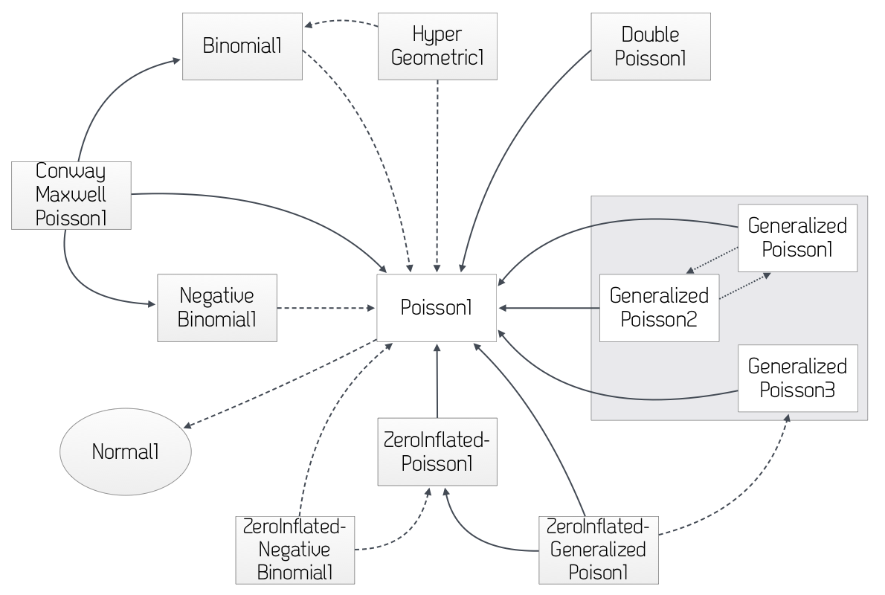

# Model Object

The [Model Object] within the MDL is intended to describe the mathematical
and statistical properties of the model. MDL defines language elements
that allow the user to code a wide variety of models and in a variety of
ways. The Model Object is intended to specify the model independent of
the target software which will be used for the task (estimation or
simulation). The same model should be able to be used for a variety of
tasks – estimation, simulation or optimal design without recoding. The
[Model Object] should also be independent of the data – where possible we
use enumerated types for categorical covariates and outcomes so that
definition of the model is clear to any user regardless of the data used
in a given task.

It should be noted however that MDL does not guide the user about
whether the model that is defined is suitable for a given purpose or for
any target software. The user is free to define any model, however they
must also be aware that the specified model may not be useable with all
target software.

As stated in the Introduction, the [Model Object] is intended to convey
the mathematical and statistical definitions required to completely
define the model. MDL used in defining the model is intended more as a
descriptive language rather than a programmatic one. The [Model Object] is
used in tasks by combining it with Data, Parameter and Task Properties
objects, and defining tasks within the R script.

Currently defined blocks are [`IDV`], [`COVARIATES`], [`POPULATION_PARAMETERS`],
[`FUNCTIONS`], [`VARIABILITY_LEVELS`], [`STRUCTURAL_PARAMETERS`],
[`VARIABILITY_PARAMETERS`], [`GROUP_VARIABLES`],
[`RANDOM_VARIABLE_DEFINITION`], [`INDIVIDUAL_VARIABLES`] ,
[`MODEL_PREDICTION`], [`DEQ`], [`COMPARTMENT`], [`OBSERVATION`].

Which blocks within the [Model Object] are used for a particular model
depends on the structure of that model. Blocks should not be left empty
(although this is not a syntax error). It is good practice to structure
and write the model to facilitate readability and understanding of the
model. Simple statements that are clear and unambiguous are preferred to
statements combining many actions into one line of code. Use of the
[`MODEL_PREDICTION`] block is encouraged to make it clear what the
final prediction is from the model prior to use in generation of the
observation level.

In the current version of MDL, the variable names and parameter names in
the [`STRUCTURAL_PARAMETERS`] and [`VARIABILITY_PARAMETERS`] blocks of
the [Model Object] must be matched to those in the Data and Parameter
objects. The [MOG Object] brings together the Data, Parameter, Model and
Task Properties Objects to perform tasks, and at this stage it is
assumed that the variable names match across objects.

The independence of the [Data Object] from the model means that the data
referenced by the [Data Object] may be easily used with a different model
without modification of the [Data Object]. Similarly, the independence of
the [Parameter Object] from the model means that all the parameters
related to modelling project e.g. describing a particular drug, may be
stored in one place. Note that parameters defined in the Parameter
Object must have unique names.

Unlike other MDL Objects, the [Model Object] does not use a
[`DECLARED_VARIABLES`] block. Instead variables are declared when they
are used within the [`IDV`], [`COVARIATES`], [`STRUCTURAL_PARAMETERS`],
[`VARIABILITY_PARAMETERS`] blocks. Particular care may be required for
models defined using analytic equations (rather than via differential
equations, compartments). In these models it may be necessary to declare
inputs such as DOSE within the [`MODEL_PREDICTION`] block.

## On interoperability

The primary focus of MDL in this release is translation to valid
PharmML, rather than conversion to target software. The previous Public
Release was primarily concerned with demonstrating interoperability
across key software targets. In this version of MDL there may be
features supported which are not supported by certain target software,
but which are valid for model description and which generate valid
PharmML. The aim is to widen the scope of models which can be encoded in
MDL and generate PharmML, since the latter is required for uploading
models to the DDMoRe repository. Translation of these models to target
software will follow with updates to the interoperability framework
converters.

The MDL-IDE should assist the user in ensuring that the models encoded
are valid MDL (and as a consequence, also valid PharmML).

Models in MDL may be expressed in a number of ways, which may be
influenced by a number of factors including which languages the user is
familiar with for encoding models. Flexibility allows the user to encode
models quickly in a common language (MDL) which can then be shared with
others and mutually understood. This flexibility also facilitates
encoding in a given target when that language construct does not have a
parallel in other tools. **However**, we **STRONGLY** encourage the user
to encode the majority of models in a way that will facilitate
interoperability. Interoperability allows the user of the model to
choose the best tool for the job, or at least the tools that they have
available to them.

If the user follows certain conventions for coding then it will increase
the chance that a given model is interoperable between target tools.
These conventions will be highlighted in the subsequent sections, but
users should pay particular attention to sections 4.7, 4.9 and 4.10 on
definition of [`GROUP_VARIABLES`] defining fixed effects,
[`INDIVIDUAL_VARIABLES`] defining the relationship between covariates
(or [`GROUP_VARIABLES`] defined variables) and random effects and
[`MODEL_PREDICTION`] using these parameters to calculate predictions
for given inputs.

## `IDV`

The [`IDV`] block defines the independent variable within the model.
Typically this is TIME (or T for differential equations). An [`IDV`]
block must be present in the [Model Object].

The syntax is a simple variable declaration:
  
```
IDV{ <Independent variable name> }
```
  
## `COVARIATES`

The [`COVARIATES`] block declares and defines covariates to be used in
the `GROUP_VARIABLES,` [`INDIVIDUAL_VARIABLES`] and
[`MODEL_PREDICTION`] blocks (see discussion of regressors below for use
of covariates in the [`MODEL_PREDICTION`] block). Covariates listed in
the [`COVARIATES`] block must be specified as `use is covariate`
or `use is catCov` in the `DATA_INPUT_VARIABLES` block in
the [Data Object] or defined in the [`POPULATION`] block of the Design
Object. Covariate transformations may be specified within this block.
  
```
COVARIATES{
< Covariate name >
< Categorical covariate name > withCategories {< category1 >, < category2 >, … , < category_k >}
< Covariate name > = <simple transformation equation>
}
```
  
For categorical covariates, the categories defined in the [`COVARIATES`]
block must match those specified for `DATA_INPUT_VARIABLES` with
`use is catCov` – see the definition of the SEX covariate above.

An example [`COVARIATES`] block is shown below:
  
```
COVARIATES{
  WT
  SEX withCategories {female, male}
  logtWT = ln(WT/70)
}
```
  
In this example the withCategories prefix to the list of category names
will be used to link to the values associated with these names in the
[Data Object].

The logtWT variable in the [`COVARIATES`] block may be used as the value for
the cov attribute in the linear function in the [`INDIVIDUAL_VARIABLES`]
block if `WT` follows the above rules for covariates.

Please also read about the specification of covariate models in sections
4.7 and 4.9.

The definition of covariates above assumes that the covariates are
constant within individuals or vary only at occasion levels. It is also
possible to define covariates that vary with the independent variable
(typically time):
  
```
COVARIATES(type is idvDependent){
  WT
  logtWT = ln(WT/70)
}
```
  
Covariates which are defined as `idvDependent` should NOT be used in
the `type is linear` definition of `INDIVIDUAL_PARAMETERS`.

## `STRUCTURAL_PARAMETERS`

This block declares fixed effect parameters that define the structure of
the model. There is no separator character in between variable names.
The variable names do not need to be on separate lines, but it may be
easier to read if they are presented in this way and it allows comments
to be added to help communication
  
```
STRUCTURAL_PARAMETERS{
  < Variable name(s) of structural parameters >
}
```
  
For example: 
  
```
STRUCTURAL_PARAMETERS {
  POP_CL
  POP_V
  POP_KA
  POP_TLAG
  BETA_CL_WT
  BETA_V_WT
} # end STRUCTURAL_PARAMETERS
``` 
  
## `VARIABILITY_PARAMETERS`

Similar to the [`STRUCTURAL_PARAMETERS`] block, this block declares all
the variability (including covariance, correlation and residual error)
parameters (population parameter variability and other variability level
parameters) used in the model. The variable names do not need to be on
separate lines, but it may be easier to read if they are presented in
this way and allows comments to be added to help communication
  
```
VARIABILITY_PARAMETERS{
<Variable name(s) of variability parameters>
}
```
  
For example:
  
```
VARIABILITY_PARAMETERS {
  PPV_CL
  PPV_V
  CORR_CL_V
  PPV_KA
  PPV_TLAG
  RUV_ADD
  RUV_PROP
} # end VARIABILITY_PARAMETERS
```
  
### Residual Unexplained Variability

Residual variability is typically defined as a standard Normal
distribution ~N(mean=0, var=1). The standard residual error models (see
section 4.12.1) then define the parameters of that model e.g. additive
and proportional which multiply the random N(0,1) variable. They can
also define expressions involving parameters which define the residual
error model. These parameters should be declared as
[`VARIABILITY_PARAMETERS`].

## `VARIABILITY_LEVELS`

The [`VARIABILITY_LEVELS`] block defines the model hierarchy. Each
variable should have attributes defining its `level` in the model
hierarchy and variability `type` which is one of `parameter` or
`observation`. `DATA_INPUT_VARIABLES` with `use is dv` and
`use is id` are automatically identified as describing variability
levels. Additional variables can be used to define variability levels by
defining these as `use is varLevel` in `DATA_INPUT_VARIABLES`.

Typically, level = 1 is the level of each sample  / experimental unit / 
observation. Additional levels of the hierarchy built on top of this. 
Typically in population models there is at least one additional level of 
variability – that of the individual (the experimental unit). 
Occasionally if modelling summary level data in a model-based meta-analysis, 
treatment arm may be used as the experimental unit and labelled in the
`DATA_INPUT_VARIABLES` block as `use is id`.

The syntax is:
  
```
  VARIABILITY_LEVELS(reference = < ID | varLevel >){
      <Variable name> : { level = <number>, type is <parameter | observation>}
      ... # Additional levels of variability specified as above
  }
```
  
For example:  
  
```
VARIABILITY_LEVELS(reference=ID){
  ID : { level=2, type is parameter }
  DV : { level=1, type is observation }
  }
```
  
If between occasion variability is required in the model then this
should be specified here as a variability level between the observation
and individual levels. In NONMEM occasion is typically specified as an
additional layer of inter-individual variability which is defined
conditionally on an occasion variable in the dataset. In MDL this is
explicitly treated as a distinct level of variability.
  
```
VARIABILITY_LEVELS(reference=ID){
 ID : { level=3, type is parameter }
 OCC : { level=2, type is parameter }
 DV : { level=1, type is observation }
 }
```
  
Additional levels of variability are easily implemented by incrementing
`level = <number>` with an associated DATA_INPUT_VARIABLE with
`use is varLevel`. This facilitates definition of levels such as
between trial random variability.

The distinction between `type is observation` and `type is parameter` 
will be used further in future versions of MDL to
describe models where there are additional levels of hierarchy. 
For example, when describing differences between trials as a random
effect or modelling population level differences; and at the
observation level e.g. replicates of PD measurements at each time point,
or multiple assays of a single sample. Specifying variability type allows 
extensibility for the future while retaining backwards compatibility.

When estimating model parameters using observed data, the
`DATA_INPUT_VARIABLE` with `use is id` is the default “reference level 
of the model hierarchy [@Gelman2006]. When using a [Design Object], the reference 
level of the model hierarchy is likely to be implicit (subjects in a study arm) 
rather than explicit. Thus the need to specify `reference = ID`.

## `GROUP_VARIABLES`

The [`GROUP_VARIABLES`] block can be used to specify group specific
variables using parameters and fixed effect relationships between
parameters and covariates. The [`INDIVIDUAL_VARIABLES`] block can then
use these values in definition of the individual parameters by
incorporating the random between individual variabilities defined in the
[`RANDOM_VARIABLE_DEFINITION`] block(s).

Using the [`GROUP_VARIABLES`] block to define covariate relationships
is not supported for parameter estimation in some target software since
the equations defined in the [`GROUP_VARIABLES`] block are user
defined. The MDL-IDE is not equipped to determine whether the defined
relationships conform to linear relationships (after transformation)
that have been shown to allow interoperability between software.

For this reason we suggest that definition of covariate dependent
[`GROUP_VARIABLES`] is used only in cases where a reformulation to
“linear or “linear after transformation relationships with covariates
as defined in section 4.9 is not possible.

The [`GROUP_VARIABLES`] block is essential for defining relationships
between structural parameters and covariates which are non-linear, even
after transformation. For example to describe clearance across both
adults and children a maturation model may be required. For example:
  
```
GROUP_VARIABLES{
  FSIZE = (WT/70)^0.75
  FAGE = if(AGE >= 20) then exp(BETA_CL_AGE*(AGE-20))
         else 1
  FMAT = 1/(1+(PCA/TM50)^(-HILL))
  GRP_CL = POP_CL * FSIZE * FAGE * FMAT
}
```
  
GRP_CL can then be used in the definition of individual variables
within the [`INDIVIDUAL_VARIABLES`] block.

### Defining model constants

Model constants (model variables with constant values) may be defined in
MDL within the [`GROUP_VARIABLES`] block.

However, to ensure interoperability within the current SEE, constant
values in the model should be defined as `STUCTURAL_PARAMETERS` and fixed
to a value in the [Parameter Object].

For models expressed as systems of differential equations ([`DEQ`] block),
model variables can be set to constant values in the [`MODEL_PREDICTION`]
block, but this may be computationally inefficient in the target
software implementation.

## `RANDOM_VARIABLE_DEFINITION`

The [`RANDOM_VARIABLE_DEFINITION`] block defines the distribution of
the random effects to be used in construction of mixed effects models.
The [`RANDOM_VARIABLE_DEFINITION`] block defines random variables in
terms of parametric distributions.

It is assumed that all variables within the same block are defined for
the same level of the model hierarchy. Separate
[`RANDOM_VARIABLE_DEFINITION`] blocks should be used for each layer of
the model hierarchy.The user specifies which level through the
`(level = <name of variable associated with this level> )` syntax
following the [`RANDOM_VARIABLE_DEFINITION`] block name.

The following syntax is used to define random variables:
  
```
RANDOM_VARIABLE_DEFINITION( level = <VARIABILITY_LEVEL variable> ){
  <VARIABLE NAME > ~ <Distribution with arguments>
 }
```
  
The [`RANDOM_VARIABLE_DEFINITION`] block supports probability
distributions as specified in the ProbOnto knowledge base [@Swat_2016].
Typically for definition of structural parameter and residual error
random variability, Normal distributions will be used. The MDL
distribution “Normal(…) maps to either ProbOnto Normal1 or Normal2
depending on the parameterisation:

 **MDL Name**  | **Argument name** | **Argument Types** | **ProbOnto distribution**
---|---|---|---
Normal | mean | Real | Normal1  
|   | sd | Real |     
Normal | mean | Real | Normal2  
|   | var | Real |    

This means that the user does not need to remember which ProbOnto
distribution uses which parameterisation for this frequently used
distribution.

An example of `RANDOM_VARIABLE_DEFINTION` for individual random
effects is given below:
  
```
RANDOM_VARIABLE_DEFINITION( level = ID ) {
  ETA_CL  ~ Normal(mean = 0, sd = PPV_CL)
  ETA_V   ~ Normal(mean = 0, sd = PPV_V)
  ETA_KA  ~ Normal(mean = 0, sd = PPV_KA)
  ETA_TLAG ~ Normal(mean = 0, sd = PPV_TLAG)
} # end RANDOM_VARIABLE_DEFINITION
```
  
In the code above, `ETA_CL`, `ETA_V`, `ETA_KA` and `ETA_TLAG` vary with each
new value of ID. These variables are normally distributed with mean = 0
and standard deviation defined by the variability parameters. The
distribution can also be defined using variances. 

In the example above, all random variability parameters are independent.
To specify correlation or covariance between parameters, the user should
specify either pairwise correlation or covariance between random
variables or use a multivariate distribution. In contrast to the
previous version of MDL where correlations and covariances were defined
only in the [Parameter Object], this version requires the user to specify
correlations and covariances in the [`RANDOM_VARIABLE_DEFINITION`]
block. This is to allow the [Prior Object] to define priors on parameters
used in the [Model Object].

The following syntax is used to define correlation or covariance:
  
```
:: {type is <correlation / covariance>,
  rv1 = <RANDOM_VARIABLE_DEFINITION variable>,
  rv2 = <RANDOM_VARIABLE_DEFINITION variable>,
  variable = <VARIABILITY_PARAMETERS parameter> }
```
  
Note the use of the “anonymous list using double colon “:: . This is
used since we are assigning additional information to the variable
defined in the [`VARIABILITY_PARAMETERS`] block.

For example (UseCase1):
  
```
:: {type is correlation, rv1=ETA_CL, rv2=ETA_V,
value=CORR_CL_V}
```
  
Alternatively, the user can specify multivariate distribution(s) for
parameters to specify the joint distribution of multiple random
variability parameters. To do this, the user must specify the type of
parameters in the [`STRUCTURAL_PARAMETERS`] (if required) and
[`VARIABILITY_PARAMETERS`] blocks. Typically for multivariate
distributions, there may be a vector of mean values, and a matrix of
correlations or covariances. We can then use these to define the
multivariate distribution using ProbOnto definitions.

So if we assume that the random effects for CL, V and KA (ETA_CL,
ETA_V and ETA_KA in the univariate case) come from a multivariate
distribution then the distribution of the vector ETA_CL_V_KA is given
as:

$$ETA\_ CL\_ V_{\text{KA}} = \begin{bmatrix}
ETA\_ CL \\
ETA\_ V \\
ETA\_ KA \\
\end{bmatrix}\sim\ MultivariateNormal1\left( mean = \begin{bmatrix}
0 \\
0 \\
0 \\
\end{bmatrix},covariance = PPV\_ CL\_ V\_ KA \right)$$

where PPV_CL_V_KA is a covariance matrix defining the variances and
covariances of the random effects:

$$PPV\_ CL\_ V\_ KA\  = \begin{pmatrix}
PPV\_ CL & COV\_ CL\_ V & COV\_ CL\_ KA \\
COV\_ CL\_ V & PPV\_ V & COV\_ V\_ KA \\
COV\_ CL\_ KA & COV\_ V\_ KA & PPV\_ KA \\
\end{pmatrix}$$

Note that the ProbOnto distribution MultivariateNormal1 uses mean and
covariance, while MultivariateNormal2 uses mean and correlation.

For example (UseCase6_2):
  
```
VARIABILITY_PARAMETERS {
PPV_CL_V_KA::matrix
PPV_TLAG
RUV_PROP
RUV_ADD
} # end VARIABILITY_PARAMETERS

RANDOM_VARIABLE_DEFINITION(level=ID) {
ETA_CL_V_KA ~ MultivariateNormal1(mean = [0,0,0],
covarianceMatrix = PPV_CL_V_KA)
ETA_TLAG ~ Normal(mean = 0, var = PPV_TLAG)
} # end RANDOM_VARIABLE_DEFINITION
```
  
Similarly for the residual unexplained variability with mean 0 and a
fixed variance of 1, we might have a [`RANDOM_VARIABLE_DEFINITION`]
block as follows:
  
```
RANDOM_VARIABLE_DEFINITION(level=DV){
EPS_Y ~ Normal(mean = 0, var = 1)
}
```
  
To define between occasion variability we might have a
[`RANDOM_VARIABLE_DEFINITION`] block as follows:
  
```
RANDOM_VARIABLE_DEFINITION(level=OCC){
  eta_BOV_CL  ~ Normal(mean=0, var=BOV_CL)
  eta_BOV_V   ~ Normal(mean=0, var=BOV_V)
  eta_BOV_KA  ~ Normal(mean=0, var=BOV_KA)
  eta_BOV_TLAG ~ Normal(mean=0, var=BOV_TLAG)
 }# end RANDOM_VARIABLE_DEFINITION
```
  
Note that in the above example blocks, ID, DV and OCC are declared as
valid identifiers for the variability hierarchy through the
[`VARIABILITY_LEVELS`] block assuming appropriate specification within
the [Data Object] of [`DATA_INPUT_VARIABLES`] with `use is id`,
`use is varLevel` and `use is dv` for ID, OCC and DV
(respectively).
  
```
VARIABILITY_LEVELS{
  ID : { level=3, type is parameter }
  OCC : { level=2, type is parameter }
  DV : { level=1, type is observation }
  }
```
  
The [`RANDOM_VARIABLE_DEFINITION`] block can also be used to
explicitly define the distribution of individual variables, however if
this method is used, then an anonymous list must be specified in the
`INDVIDUAL_VARIABLES` block to refer to random variable defined in
this way. Parameters defined in this way cannot be used with `type is
linear` or `type is general` in the [`INDIVIDUAL_VARIABLES`]
block.

For example:
  
```
RANDOM_VARIABLE_DEFINITION(level=ID) {
  CL ~ LogNormal3(median = POP_CL, stdevLog = SD_LNCL)
  …
  }

INDIVIDUAL_VARIABLES{
  :: {type is rv, variable=CL}
  …
  }
```
  
Covariates can be included via definition in the [`GROUP_VARIABLES`]
block, but this may limit interoperability and translation of the model
to target software.

For example:
  
(See [`GROUP_VARIABLES`] block example above for definition of GRP_CL)  
  
```
RANDOM_VARIABLE_DEFINITION(level=ID) {
  CL ~ LogNormal3(median = GRP_CL, stdevLog = SD_LNCL)
  …
  }
```
  
The [`RANDOM_VARIABLE_DEFINITION`] block is also used to specify
non-continuous outcome variables i.e. count, binary, categorical. See section 
4.12.2.

## `INDIVIDUAL_VARIABLES`

The [`INDIVIDUAL_VARIABLES`] block is used to express how the fixed
effect variables (population parameters, covariates with their
associated fixed effect parameters) and random effects (defined in the
[`RANDOM_VARIABLE_DEFINITION`] block) combine to define the individual
variables which will be used in the [`MODEL_PREDICTION`] block to
calculate predictions for given inputs. If this is not a population
model or if variables are completely defined through the
[`GROUP_VARIABLES`] block then this block is not required. However,
that might break interoperability with some tools like Monolix, which
require the definition of individual parameters

There are three principle ways of defining [`INDIVIDUAL_VARIABLES`] and
these will be described below.

The only way of defining [`INDIVIDUAL_VARIABLES`] that is currently
supported for parameter estimation across target software is the “linear
after transformation method described in section 4.9.1 below.

### Mixed effect model with linear fixed effects and normally distributed 
random effects 

In some cases it is possible to express the fixed effects of covariates
for a population parameter as a linear model with normally distributed
random effects, sometimes employing a simple transformation (log, logit
etc.) to achieve this.

We refer to this as a linear covariate model and this equates to the
following mathematical definition:

$${h(\psi}_{i}) = h\left( \left. \ \psi_{\mathrm{\text{pop}}} \right.\  \right) + \ \beta C_{i} + \eta_{i}$$

$\psi_{i}$ – Individual parameter

$\psi_{\mathrm{\text{pop}}}$ – Typical or population mean parameter

$\beta$ – Fixed effects

$C_{i}$ – Covariates

$\eta_{i}$ – Random effect

h – Transformation function – typically log, logit, probit etc.

The MDL syntax for this form of specification is:
  
```
 <Individual parameter>
 : {type is linear, trans is <h>,
 pop = <Population STRUCTURAL parameter>,
 fixEff = [ {coeff = <Fixed Effect STRUCTURAL parameter for covariate>,
 cov = <Covariate in COVARIATES block conforming to rules below>}
 ,
 … <Additional coefficient and covariate pairs as above> ],
 ranEff = [ RANDOM_VARIABLE_DEFINITION parameter(s) ] )
```
  
The `fixEff` and `trans` arguments are optional.

Note that the syntax allows 
conditional assignment of list types to the parameter. So if the model
for a parameter varies according to a covariate or variable value, then
this can be reflected in the condition applied.

Note that left hand side transformations of the individual parameters
are no longer allowed. The transformation specified in the `trans`
argument applies to both the left hand side and right hand side of the
equation. The ranEff argument expects a vector of random variables. If
there is only one random variable the square brackets are not required.

For example (UseCase1):
  
```
CL : {type is linear, trans is ln, pop = POP_CL,
 fixEff = [{coeff=BETA_CL_WT, cov=logtWT}] ,
 ranEff = ETA_CL }
```
  
Using this construct for individual variables equates to the MU
referencing approach in NONMEM and the standard definition of individual
parameters in Monolix.

As discussed in the documentation of the [Data Object] defining covariates
(section 3.3.5.1) certain constraints are placed on the type of
covariate used in this form of specification. When covariates are
defined within the Model Object [`COVARIATES`] block and used in the
specification of `INDIVIDUAL_PARAMETERS` using the 
`linear( …, fixEff=[{coeff=<coefficient>, cov = <covariate>}] )`
construct, they must have particular properties:

  *   They must be constant within an individual or constant within an
    occasion.

  *   They will only be allowed simple transformations within the model
    e.g. centering on a median / mean and/or log transformation, logit
    transformation.

  *   The transformation cannot depend on another covariate.

  *   Statistical models (random effects) on covariates are not supported.

If a categorical covariate is used, then the catCov argument in fixEff
should refer to the appropriate category of the covariate. For example
(UseCase5):
  
```
CL : {type is linear, trans is ln,
  pop = POP_CL,
  fixEff = [
    {coeff = BETA_CL_WT, cov = logtWT},
    {coeff = POP_FCL_FEM, catCov = SEX.female },
    {coeff = BETA_CL_AGE, cov = tAGE}
    ],
  ranEff = ETA_CL }
```
  
If the categorical covariate has more than k>2 categories then the user
needs to specify k-1 dichotomous “dummy covariates to specify the
factor levels and appropriate contrasts (between level k and an
appropriate comparison value). For example when adding GENOTYPE as a
categorical covariate, the user may want to compare each category of
GENOTYPE to a suitable reference value of the covariate. In this case
all of the “dummy dichotomous comparison covariates should be included
in the model in one step.

If between occasion variability is specified in a
[`RANDOM_VARIABLE_DEFINITION`] block then the associated random
effects can be specified in a vector form of the ranEff attribute. These
will be added into the linear equation. For example (UseCase8):
  
```
CL : {type is linear, trans is ln, pop = POP_CL,
      fixEff = [{coeff=BETA_CL_WT, cov=logtWT}] ,
      ranEff = [eta_BSV_CL, eta_BOV_CL ]}
```
  
### General mixed effect model with Gaussian random effects. 

The second formulation for the `INDVIDUAL_PARAMETERS` block uses
variables defined in the [`GROUP_VARIABLES`] block and assumes that the
random effect is additive i.e. is Gaussian (Normally distributed) or
Gaussian after transformation.

We refer to this as a “general or Gaussian after transformation model
and the associated mathematical representation is:

$${h(\psi}_{i}) = H\left( \beta,C_{i} \right) + \ \eta_{i}$$

$\psi_{i}$ – Individual parameter

$\psi_{\mathrm{\text{pop}}}$ – Typical or population mean parameter

$\beta$ – Fixed effects

$C_{i}$ – Covariates

$\eta_{i}$ – Random effect

H – Arbitrary function

h – Transformation function – log, logit, probit.

Where $H\left( \beta,C_{i} \right)$ is defined in the
[`GROUP_VARIABLES`] block.

The MDL syntax for this form of specification is:
  
```
<Individual parameter> : {type is general,
                          grp = <GROUP_VARIABLES defined variable >,
                          trans is <ln / logit / probit>,
                          ranEff = [ RANDOM_VARIABLE_DEFINITION parameter(s) ] )
```
  
The trans argument is optional.

If the trans argument is used, then it is assumed that
appropriate transformations have been made in the [`GROUP_VARIABLES`]
block or in the assigned value for the grp attribute to ensure that
the fixed effect and random effect are additive and on the correct scale
given the transformation.

For example, for the GROUP_VARIABLES defined in section 4.7 above:
  
```
CL : {type is general, grp = ln(GRP_CL),
      trans is ln,
      ranEff = ETA_CL)
```
  
This corresponds to the following equation for CL:

$\ln\left( \text{CL} \right) = \ln\left( \text{GR}P_{\text{CL}} \right) + ETA_{\text{CL}}$

which, after back-transformation is equivalent to:

$CL = GRP_{\text{CL}}*exp(ETA_{\text{CL}}$)

### Mixed effect model defined by equations

The individual variables can also be defined using expressions by
combining parameters with variables defined in [`GROUP_VARIABLES`] and
random effects .

For example:

`CL = POP_CL * exp(ETA_CL)`

Or (using a variable GRP_CL defined in the [`GROUP_VARIABLES`] block as
defined above)

`CL = GRP_CL * exp(ETA_CL)`

It is also possible to define fixed and random effect expressions as
follows:

`CL=POP_CL * (WT/70)^0.75 * exp(eta_PPV_CL)`

Which can be log transformed into a linear form of mixed effect model
like this:

` CL=exp(ln(POP_CL)+ 0.75 * ln(WT/70) + eta_PPV_CL)`

However, note that while it is possible for the user to “see that the
equation above is linear in the fixed and random effects, it is not
possible for the MDL-IDE to determine this. To specify linear models we
must explicitly do so using the `{type is linear, … }` construct
described in section 4.9.1.

### INDIVIDUAL_VARIABLES without inter-individual variability

For interoperability reasons, parameters defined in the
[`STRUCTURAL_PARAMETERS`] block without associated variability i.e.
where the individual value is the same as the parameter value, should be
defined within the [`INDIVIDUAL_VARIABLES`] block. If the model
parameter is constrained to be positive, then an appropriate
transformation should be used to ensure a positive value.

### [`INDIVIDUAL_VARIABLES`] where the variable is defined in the 
[`RANDOM_VARIABLE_DEFINITION`] block.

As discussed in section 0 above, if the individual variable is defined
completely via a distribution in the [`RANDOM_VARIABLE_DEFINITION`]
block, then an anonymous list must be used to declare the variable
within the [`INDIVIDUAL_VARIABLES`] block.

The syntax for the anonymous list is:
  
```
:: {type is rv, variable = <RANDOM_VARIABLE_DEFINITION
variable>}
```
  
### Conditional assignment of [`INDIVIDUAL_VARIABLES`]

It is possible to apply conditional handling to the assignment of
[`INDIVIDUAL_VARIABLES`]. Note that the conditioning occurs on the RIGHT
HAND SIDE of the expression ONLY. The conditioning statement should
follow the conventions described in section 9.1.4.4.

The syntax is as follows:
  
```
<Individual variable>
  : if(condition1) then { INDIVIDUAL_VARIABLE list 1 }
    elseif(condition2) then { INDIVIDUAL_VARIABLE list 2 }
    else { INDIVIDUAL_VARIABLE list 3 }
```
  
Note the use of an “else statement to ensure that <Individual
parameter> is always assigned a value.

For example:
  
```
CL : if(RF==RF.normal) {type is linear, trans is ln,
                        pop = POP_CL, fixEff = {coeff = BETA_CL_WT, cov = logtWT},
                        ranEff = ETA_CL }
                        
      else {type is general, trans is ln, 
            grp = ln(GRP_CL), 
            ranEff = ETA_CL }
``` 
  
In the above, the expression for individual Clearance is conditional on
whether the subject’s renal function (RF) is “normal or not. The user
would need to have defined a suitable model for GRP_CL in the
[`GROUP_VARIABLES`] block. (RF is a categorical data variable that has
a symbolic value of “normal and other categories which are not used in
this example).

Please also see sections 9.1.4.4 and 9.1.4.5 for further information on
handling of conditional statements.

### [`INDIVIDUAL_VARIABLES`] definitions in practice.

As has been discussed above, to facilitate interoperability we strongly
suggest that users try to formulate their models using the {type is
linear, … } form shown in section 4.9.1 with the caveat included
about the forms of covariate relationships that can be used within this
construct.

In some cases, users may have to consider how their model is constructed
more carefully. For example, in a pharmacodynamic model:

`PD = PD_BASELINE + PD_BETA\*CP + ETA_PD`

It may be tempting to try to write this as a `{type is linear, … }` 
relationship with CP as a covariate, but recall that covariates may
not be time-varying, and CP would almost certainly break this rule.

If we encode `GRP_PD = POP_BASELINE + POP_BETA\*CP` as a
`GROUP_VARIABLE` and then add ETA_PD in [`INDIVIDUAL_VARIABLES`] using
the `{type is general, … }` form then the GRP_PD is also
time-varying.

`INDIV_PD : {type is linear, pop = GRP_PD, ranEff = [ETA_PD])`

However if we break the above model into components, then we can use
`{type is linear, … }` to express an individual baseline

`INDIV_BASE : {type is linear, pop = POP_BASELINE, ranEff = ETA_BASE)`

`INDIV_BETA : {type is linear, pop = POP_BETA, ranEff = ETA_BETA)`

We can then move the linear relationship with CP to the
[`MODEL_PREDICTION`] block
  
``` 
MODEL_PREDICTION{
  PD = INDIV_BASE + INDIV_BETA\*CP
  }
```
  
Using the [`INDIVIDUAL_VARIABLES`] block to define individual
parameters which are then used in [`MODEL_PREDICTION`] should allow
most models to be interoperable.

## `MODEL_PREDICTION`

The [`MODEL_PREDICTION`] block is where the structural model
predictions are defined. Calculations use mathematical expressions that
may involve the population parameters (structural) as well as group and
individual variables (parameters).

If a [`MODEL_PREDICTION`] block is not supplied this is not an error
but requires that any prediction referred to in the [`OBSERVATION`]
blocks has been defined using variables in a [`GROUP_VARIABLES`] or
INDIVIDUAL_VARIABLE block.

For example below we present the [`MODEL_PREDICTION`] block using
variables DOSE, V, CL, V and TIME.
  
```
 MODEL_PREDICTION{
 DOSE::dosingVar # recall that DOSE must be declared before use in
 analytical models.
 CONC=DOSE/V*exp(-CL/V*TIME)
 }
``` 
  
If a DEQ sub-block is specified then variables calculated within the DEQ
sub-block can be referred to outside of this block to calculate the
model prediction. An example is given below.

To ensure interoperability, any variable used in the [`MODEL_PREDICTION`]
block must be either:

*   the independent variable
*   defined in [`MODEL_PREDICTION`]
*   declared in INDIVIDUAL_VARIABLES using {type is linear, … }
*   defined as “use is variable in the DATA_INPUT_VARIABLES block
    of the [Data Object]

This implies in particular that [`STRUCTURAL_PARAMETERS`],
[`VARIABILITY_PARAMETERS`], [`GROUP_VARIABLES`] and random variables defined
in `RANDOM_VARIABLES_DEFINITION` cannot be used in [`MODEL_PREDICTION`].

### `DEQ`

Use of a [`DEQ`] sub-block is optional – differential equations may be
used anywhere in the [`MODEL_PREDICTION`] block – but it is encouraged
to use this sub-block for clarity and readability of the resulting code.

The [`DEQ`] sub-block specifies the structural model through
differential equations. The general form is
  
```
<VARIABLE> : { deriv = <expression>, init = <Real number>,
                x0 = <Real number> }
```
  
The [`DEQ`] sub-block combines equations and differential equations and
the resulting system of equations is integrated across the independent
variable, usually time.

`init = <Real number>` is the initial value of the differential equation

`x0 = <Real number>` is the starting value of the integrator. For most
systems involving time, this is zero.

By default, `init = 0` and `x0 = 0`. If the default is to be used, these
arguments can be dropped from specification of the differential
equation.

For example:
  
```
MODEL_PREDICTION {
DEQ{
 RATEIN = if(T >= TLAG) then GUT \* KA
 else 0
 GUT : { deriv =(- RATEIN), init = 0, x0 = 0 }
 CENTRAL : { deriv =(RATEIN - CL \* CENTRAL / V) }
 }
 CC = CENTRAL / V
 } # end MODEL_PREDICTION
```
  
### On Tlag and Bioavailability

Since MDL has no reserved variable names, there is no mechanism for
target software to identify lagtime and bioavailability. . Models with
lag times and bioavailability must use the [`COMPARTMENT`] sub-block to
specify these input attributes.

### `COMPARTMENT`

The [`COMPARTMENT`] sub-block is intended to provide the user with a
modular approach to describe PK processes through definition of the drug
input, distribution, and elimination processes. The functions defined
are influenced by the PK macros approach in Monolix. The table below
shows how the Compartment definitions in MDL correspond to PK Macros as
defined in Monolix.

  **MDL Compartment** | **Monolix PK Macros**
  --------------------| -----------------------
  direct              |  iv
  depot               |  absorption
  elimination         |  elimination
  distribution        |  peripheral
  effect              |  effect
  transfer            |  transfer
  compartment         |  compartment

The major differences over the implementation in Monolix are that in
MDL, the “from and “to attributes define the links between
compartments and processes and that there are no reserved names for
compartments or variables e.g. using “K12 and “K21 as variable names
confers no special meaning to the use of these variables.

[`COMPARTMENT`] definitions are translated into PK Macros in Monolix and
where possible they are mapped to ADVAN closed-form solutions in
NONMEM.

[`COMPARTMENT`] sub-block processes are specified as lists with
attributes depending on the processes being described.

#### Input & absorption

There are two [`COMPARTMENT`] block processes describing input to the
system (typically drug input). These are direct and depot.
direct defines bolus or zero-order input processes, while depot
describes first-order, zero-order or transit chain drug input processes.

Input format is of the form:
  
```
<VARIABLE NAME> : { type is <depot / direct>,
                    to = <VARIABLE>,
                    <other arguments> }
``` 
  
The other arguments depend on the process being described. The table
below describes the possible combinations of attributes for different
input and absorption processes.

  **Compartment Type**  | **Attribute Combination**
  ----------------------|----------------------------------------------------
  Direct                | to, modelDur(O), tlag(O), finput(O)
  Depot                 | to, ka, tlag(O), finput(O)
  |                      | to, modelDur, tlag(O), finput(O)
  |                      | to, ka, ktr, mtt
  |                      | to, modelDur, ktr, mtt

  ( O ) = Optional attribute
  
``` 
INPUT_KA : {type is depot, to=CENTRAL, ka=KA,
            tlag=ALAG1, finput=F1}
```
  
#### Distribution processes

MDL defines drug distribution (movement of drug between compartments)
through [`COMPARTMENT`] block definitions with type compartment,
distribution.

`type is compartment` is used to define PK compartments which have
an associated input and elimination process. Peripheral compartments
with `type is distribution` will not have `type is input` or
`type is elimination` processes associated with them.

The syntax is:

`<VARIABLE NAME> : { type is compartment }`

The modelCmt argument is not used.

For example:

`CENTRAL : { type is compartment }`

Compartments where the transfer of drug in and out is defined through
model variables have `type is distribution`.
  
```
 <VARIABLE NAME> : {type is distribution, from = <VARIABLE NAME>, 
                    kin = <VARIABLE NAME>, kout = <VARIABLE NAME> }
```
  
For example, to specify a peripheral compartment in a two compartment PK
model:

`PERIPHERAL : {type is distribution, from=CENTRAL, kin=Q/V2, kout=Q/V3}`

A “type is effect process provides a means to describe the
transfer of amounts from a given compartment to an effect compartment
e.g. for use with PD models.

`<VARIABLE NAME> : {type is effect, from = <VARIABLE> NAME>, keq = <VARIABLE NAME>}`

  **Compartment Type**  | **Attribute Combination**
  ----------------------|-------------------------------
  distribution          | from, kin, kout
  compartment           |  
  effect                | from, keq

#### Elimination and transfer processes

Elimination is defined via a list with “type is elimination and
specification of the compartment from which drug is eliminated along
with variable names for the volume of distribution in the compartment
from which drug is eliminated and the micro constant or apparent
clearance from the compartment.

If the amount of eliminated drug is not of interest, it is not necessary
to name this process. If this is the case, an anonymous list must be
used:
  
```
 :: { type is elimination, from = <VARIABLE NAME>, v = <VARIABLE NAME>, 
        <k / cl> = <VARIABLE NAME> }
```
  
For example in the one compartment model:

` :: {type is elimination, from=CENTRAL, v=V, cl=CL}`

Note that the v argument refers to the volume of distribution in the
compartment defined by the from argument.

A “type is transfer process has also been provided which
defines the one-way transfer of drug amounts from one compartment to
another.
  
```
<VARIABLE NAME> : {type is transfer, from = <VARIABLE NAME>, 
                    to = <VARIABLE NAME>, kt = <VARIABLE NAME> }
```
  
For example:
` :: {type is transfer, from=LATENT, to=CENTRAL, kt=K23}`

  **Compartment Type**  | **Attribute Combination**
  ----------------------|---------------------------
  elimination           | from, v, k
 |                      | from, v, cl
 |                      | from, vm, km
  transfer              | from, to, kt

Combining [`COMPARTMENT`] and [`DEQ`] blocks
-----------------------------------------

It is possible to use [`COMPARTMENT`] to describe the input processes
for differential equations in the [`DEQ`] block. Using the `type is
depot` or `type is direct` compartments allows the user to
specify lag time and bioavailability (tlag and finput) which
will translate to appropriate terms in target software e.g. ALAGn and Fn
in NM-TRAN. If the [`COMPARTMENT`] specification is not used then model
parameters are treated in a very general way and there is no way of
mapping these to target tools to implement these input attributes.

If the [`COMPARTMENT`] sub-block is not used then delay absorption processes
and/or bioavailability needs to be explicitly encoded.

For example in UseCase4 differential equations are used to describe IV
and oral administration. The time of dosing DT is passed either from the
data or via `DATA_DERIVED_VARIABLES` (see section 2.5):
  
```
MODEL_PREDICTION {
  DT
  DEQ{
    RATEIN = if(T-DT >= TLAG) then GUT * KA
    else 0
    GUT : { deriv =(- RATEIN), init = 0, x0 = 0 }
    CENTRAL : { deriv =(RATEIN * FORAL - CL * CENTRAL / V), init = 0, x0 = 0 }
}
CC = CENTRAL / V
} # end MODEL_PREDICTION
```
  
In the above example, note that there is a discontinuity in RATEIN which
is not well handled with differential equations. Note also that the
model does not handle multiple doses since then DT (time of dose) and
hence RATEIN would be reset to zero for each new dose.

To alleviate this problem, we can use [`COMPARTMENT`] with [`DEQ`] to handle
the input processes correctly. The code below shows how to include lag
time and bioavailability in a model using differential equations
(UseCase4_2):
  
```
MODEL_PREDICTION {
COMPARTMENT{
  INPUT_KA : {type is depot, to=CENTRAL, ka=KA, finput=FORAL, tlag=TLAG}
  INPUT_CENTRAL : {type is direct, to = CENTRAL}
}

DEQ{
  CENTRAL : { deriv =( - CL \* CENTRAL / V), init = 0, x0 = 0 }
  }
CC = CENTRAL / V
} # end MODEL_PREDICTION
```
  
(Note that this model is not exactly equivalent to UseCase4 which does
not allow for superposition of dosing). Note the first-order input to
the CENTRAL compartment (INPUT_KA) is `type is depot` while the
bolus or zero-order rate input (INPUT_CENTRAL) is `type is direct`.

The model corresponding to UseCase4 is shown below (UseCase4_3). In
this case there is an explicit differential equation for the depot
compartment (GUT)
  
```
MODEL_PREDICTION {
COMPARTMENT{
INPUT_KA : {type is direct, to = GUT, finput=FORAL,
tlag=TLAG}
INPUT_CENTRAL : {type is direct, to = CENTRAL}
}

DEQ{
GUT : { deriv =(- GUT \* KA), init = 0, x0 = 0 }
CENTRAL : { deriv =(GUT \* KA - CL \* CENTRAL / V), init = 0,
x0 = 0 }
}
CC = CENTRAL / V
} # end MODEL_PREDICTION
```
  
In the code above, note that both administrations use `type is
direct`, but the oral administration (INPUT_KA) has finput and
tlag specified. In contrast to the above, the direct input would
exactly correspond to the DEQ specification in UseCase4, however the
TLAG in UseCase4 is treated as a general parameter, while the TLAG in
UseCase4_3 will be translated to ALAGn in NMTRAN.

## `OBSERVATION`

The [`OBSERVATION`] block provides the definition of the outcome
variable using the prediction from the [`MODEL_PREDICTION`] block
and/or [`RANDOM_VARIABLE_DEFINITION`] at the observation level. 
Calculations or equations needed for this definition can be defined in the
[`OBSERVATION`] block e.g. calculation of weights for `type is
userDefined` error models.

If more than one outcome is specified then we specify each outcome
separately within the [`OBSERVATION`] block. Conditional
assignment to outcome definitions is possible if the outcome depends on
a covariate or calculated variable. However it is not necessary to
conform multiple outcomes to a single observation variable name e.g. Y.

### Continuous outcomes

For continuous outcomes the [`OBSERVATION`] block defines how a variable
from the [`MODEL_PREDICTION`] block and
[`RANDOM_VARIABLE_DEFINITION`] providing the residual unexplained
random variables are combined in a function to define the outcome.

The mathematical representation of the outcome variable is (after
Lavielle, 2014)

$$h\left( y_{\text{ij}} \right) = h\left( f\left( x_{\text{ij}},\psi_{i} \right) \right) + g\left( f\left( x_{\text{ij}}{,\psi}_{i} \right),\ \xi \right)\varepsilon_{\text{ij}}$$

Where

$$y_{\text{ij}} = \text{jth}\ \mathrm{\text{observation\ for\ subject}}\ i$$

*h* = Transformation of the outcome to ensure that the resulting
function is an additive function of *f* and *g.* Specfied in MDL error
models described below using “trans is <h>. Left hand side
transformation is specified using the Boolean lhsTrans.

*f* = structural model prediction from the [`MODEL_PREDICTION`] block.
Specified in the MDL error models described below through the
“prediction argument.

*g* = functional definition of the residual error model. Specified in
the MDL error models through the `type is additiveError |
proportionalError | combinedError1 | combinedError2`

$\psi_{i}$ = individual parameters defined in the
INDIVIDUAL_VARIABLES block

$x_{i,j}$ = covariates and regression variables e.g. time, concentration
etc.

$\xi$ = parameters of the residual error model defined in the
VARIABILITY_PARAMETERS block and referred to in the appropriate
`additive` and `proportional` arguments.

$\varepsilon_{\text{ij}}$= residual error defined in
[`RANDOM_VARIABLE_DEFINITION`] block and referred to in the MDL error
models described below through the `eps` argument.

The syntax for definition of continuous outcome variables is:
  
```
< OUTCOME VARIABLE NAME> : {type is additiveError |
proportionalError | combinedError1 | combinedError2 | userDefined,
<additional arguments defined in table below> }
```
  
The following residual error model functions are defined, as described
in MDL Language Reference section 2.21 and reiterated here.

  -----------------------------------------------------------------------------
  **Name**            |**Return Type** |**Argument name**  |**Argument Types**
  --------------------|----------------|-------------------|--------------------
  additiveError       | Real           |  trans (Optional) | Builtin
|                      |                |  lhsTrans         | Boolean
|                      |                |  additive         | Real
|                      |                |  prediction       | Real
|                      |                |  eps              | Real
  proportionalError   | Real           | trans (Optional)  | Builtin
|                      |                | lhsTrans          | Boolean
|                      |                | proportional      | Real
|                      |                | prediction        | Real
|                      |                | eps               | Real
  combinedError1      | Real           | trans (Optional)  | Builtin
|                      |                | lhsTrans          | Boolean
|                      |                | additive          | Real
|                      |                | proportional      | Real
|                      |                | prediction        | Real
|                      |                | eps               | Real
  combinedError2      | Real           |  trans (Optional) | Builtin
|                      |                | lhsTrans          | Boolean
|                      |                | additive          | Real
|                      |                | proportional      | Real
|                      |                | prediction        | Real
|                      |                | eps               | Real
  userDefined         | Real           | value             | Real
|                      |                | weight            | Real
|                      |                | prediction        | Real|

`combinedError1` defines the following model:

$$h\left( y_{\text{ij}} \right) = h\left( f\left( x_{\text{ij}},\psi_{i} \right) \right) + \left( a + bf\left( x_{\text{ij}}{,\psi}_{i} \right) \right)\varepsilon_{\text{ij}}$$

`combinedError2` defines the following model:

$$h\left( y_{\text{ij}} \right) = h\left( f\left( x_{\text{ij}},\psi_{i} \right) \right) + \sqrt{a^{2} + b^{2}f\left( x_{\text{ij}}{,\psi}_{i} \right)}\varepsilon_{\text{ij}}$$

the lhsTrans Boolean argument allows the user to apply transformations
to the DV without having to transform the data column prior to analysis.

As with the `type is linear` and `type is general`
definitions in the [`INDIVIDUAL_VARIABLES`] block, we use defined types
here to make explicit the relationships between predictions and residual
random variable terms to facilitate interoperability between target
software.

Use `type is userDefined` to specify an arbitrary relationship
between prediction, the residual error random variable which is
typically Normal(0,1), and the with associated function g(.) defined
above. Using this form ensures that correct calculation of the weighted
residuals can be calculated.

The current version of MDL does not support definition of outcomes with
arbitrary functions of variables and random variables. Any equations
written in the [`OBSERVATION`] block are treated as variables to be used in
definition of the observation through a list definition as described
above (including UserDefined). If a list definition is not used, then
the observation equation may not be translated correctly to the target
software tool.

### Discrete data

Discrete data outcomes are described by referencing a suitable
distribution for the outcome. In this version of MDL we assume that the
parameters of the relevant distributions are supplied either in the
data, for example the number of trials, N, in a binomial distribution,
or are defined in the [`MODEL_PREDICTION`] block.

In this version of MDL we assume an identity link for all models – that
is the parameter supplied to the distribution must be on the appropriate
scale for that distribution – the Poisson rate parameter must have a
positive value, probabilities for binary and categorical distributions
must be on the scale (0,1).

Count, discrete, categorical outcomes must be specified within the
[`RANDOM_VARIABLE_DEFINITION`] block for the dv level via a suitable
ProbOnto distribution (see also section 0). The random variable is then
declared in the [`OBSERVATION`] block via an anonymous list, as has been
seen previously when defining individual variables via the
[`RANDOM_VARIABLE_DEFINITION`] block. Since continuous outcomes have a
residual error specified at the DV level, it is inferred that the
outcome defined in the [`OBSERVATION`] block is at the DV level of
variability. However for other types of data, it is less clear that this
is the case. Thus we must use [`RANDOM_VARIABLE_DEFINITION`] to define
these outcomes using ProbOnto definitions and then provide additional
information in the [`OBSERVATION`] block to assign additional
attributes.

The syntax is as follows:
  
```
RANDOM_VARIABLE_DEFINITION(level=DV){
  <outcome variable> ~ <ProbOnto distribution>
}
  
OBSERVATION{
  :: {type is <count/discrete/categorical>, variable = <outcome variable>}
}# end ESTIMATION
```
  
See below for examples pertaining to specific outcome types.

#### Count data

For count data, we have the following syntax:
  
```
RANDOM_VARIABLE_DEFINITION(level=DV){
<variable> ~ <ProbOnto distribution for count data e.g. Poisson1>
}

OBSERVATION{
:: {type is count, variable = <variable>}
}# end ESTIMATION
```
  
For example (also showing the appropriate [`INDIVIDUAL_VARIABLES`],
[`MODEL_PREDICTION`] and [`OBSERVATION`] blocks) (UseCase11)
  
```
INDIVIDUAL_VARIABLES{
BASECOUNT : {type is linear, trans is ln,
pop = POP_BASECOUNT, ranEff = eta_PPV_EVENT }
BETA = POP_BETA
}# end INDIVIDUAL_VARIABLES

MODEL_PREDICTION{
lnLAMBDA=ln(BASECOUNT) + BETA\*CP
LAMBDA = exp(lnLAMBDA)
}

RANDOM_VARIABLE_DEFINITION(level=DV){
Y ~ Poisson1(rate=LAMBDA)
}

OBSERVATION{
:: {type is count, variable = Y}
}# end ESTIMATION
```
  
Note in the above example that the BASECOUNT variable is specified using
the linear function and a natural log transformation on both sides to
ensure that BASECOUNT is positive. The linear relationship with CP
(plasma concentration) is defined within the [`MODEL_PREDICTION`]
block. We cannot use CP as a covariate in the `linear(…)` function as CP
varies with time and so is regarded as a regressor rather than a
covariate. In UseCase11 since there is no model for the pharmacokinetics
we use CP as the independent variable ([`IDV`]) in the model and `use is
idv` in the `DATA_INPUT_VARIABLES` block. We also take
exponential of lnLAMBDA to ensure that the variable LAMBDA is on the
positive scale before using this in the Poisson distribution.

This is an example where a little consideration of the random effects
and model prediction can facilitate interoperability. Writing an
equation for the INDVIDUAL_VARIABLES we may have defined
  
```
INDIVIDUAL_VARIABLES{
 lnLAMBDA = ln(POP_BASECOUNT) + BETA\*CP + eta_PPV_EVENT
 }
```
  
Using this formulation of the model though would not guarantee
interoperability with some target software for estimation since the
equation for lnLAMBDA is user-defined.

There are many distributions defined in ProbOnto which will describe
count data. The diagram below (Figure \@ref(fig:ProbOntoPoisson)) 
illustrates a few of these and relationships between them as 
described in the ProbOnto Knowledge Base
([www.probonto.org](http://www.probonto.org))

```{r ProbOntoPoisson, fig.cap="ProbOnto Poisson distributions", out.width='100%', echo=F}

```

#### Binary data

Similar to count data above, we define the binary outcome and its
distribution in a [`RANDOM_VARIABLE_DEFINITION`] block at the
observation level of variability. Note how we define the names of the
categories on the left hand side, and then the probability distribution
defines the likelihood of the *second* category.
  
```
RANDOM_VARIABLE_DEFINITION(level=DV){
  Y withCategories {<category1>,<category2>} 
     ~ <ProbOnto distribution e.g. Bernoulli | Binomial>
}
```
  
For example (again, showing the [`INDIVIDUAL_VARIABLES`],
[`MODEL_PREDICTION`] and [`OBSERVATION`] blocks to show the model
construction):
  
```
RANDOM_VARIABLE_DEFINITION(level=ID){
  eta_PPV_EVENT ~ Normal(mean=0, var=PPV_EVENT )
}# end RANDOM_VARIABLE_DEFINITION

INDIVIDUAL_VARIABLES{
  indiv_BASE : {type is linear, pop= POP_BASEP,
  ranEff=[eta_PPV_EVENT], trans is logit}
}# end INDIVIDUAL_VARIABLES

MODEL_PREDICTION{
  LP = logit(indiv_BASE) + POP_BETA\*CP
  P1 = invLogit(LP)
}# end MODEL_PREDICTION

RANDOM_VARIABLE_DEFINITION(level=DV){
  Y withCategories {none, event} ~ Bernoulli1(probability=P1)
}

OBSERVATION{
  :: {type is discrete, variable = Y }
}# end ESTIMATION
```
  
Note that the [`INDIVIDUAL_VARIABLES`] block defines the individual
baseline by combining the population parameter and the random effect.
Note also that this specification uses a logit transformation to
ensure that the individual baseline indiv_BASE variable is on the (0,1)
probability scale. Then, the linear regression with plasma concentration
(CP) is defined in the [`MODEL_PREDICTION`] – Note that CP is not a
covariate. Finally LP is back-transformed to the probability scale to
give variable P1 which is the probability of an event to be used in the
Bernoulli distribution. By defining how the 0,1 in the data correspond
to named events {none, event} it is easier to understand exactly what
category is being modelled.

An alternative distribution for the same model is the Binomial
distribution with one trial:
  
```
RANDOM_VARIABLE_DEFINITION(level=DV){
  Y withCategories {none, event} ~ Binomial1(numberOfTrials=1, probability=P1)
}

OBSERVATION{
  :: {type is discrete, variable = Y }
} # end of OBSERVATION
```
  
#### Categorical data

Again, similar to count and binary data, the syntax for Categorical data
outcomes is:
  
```
RANDOM_VARIABLE_DEFINITION(level=DV){
<variable> withCategories{ <category1>, …, <categoryk> } 
          ~ <ProbOnto distribution for categorical data
          e.g. CategoricalNonordered1 | CategoricalOrdered1>
}

OBSERVATION{
  :: {type is categorical, variable=<variable>}
}
```
  
For example (UseCase13_1):
  
```
GROUP_VARIABLES{
  B0 = Lgt0
  B1 = B0 + Lgt1
  B2 = B1 + Lgt2
}

INDIVIDUAL_VARIABLES{
  indiv_B0 : {type is general, grp = B0, ranEff = eta_PPV_EVENT}
  indiv_B1 : {type is general, grp = B1, ranEff = eta_PPV_EVENT}
  indiv_B2 : {type is general, grp = B2, ranEff = eta_PPV_EVENT}
}# end INDIVIDUAL_VARIABLES

MODEL_PREDICTION{
  EDRUG = Beta * CP
  A0 = indiv_B0 + EDRUG
  A1 = indiv_B1 + EDRUG
  A2 = indiv_B2 + EDRUG
  P0 = invLogit(A0)
  P1 = invLogit(A1)
  P2 = invLogit(A2)
  Prob0 = P0
  Prob1 = P1 - P0
  Prob2 = P2 - P1
  Prob3 = 1 - P2
} # end MODEL_PREDICTION

RANDOM_VARIABLE_DEFINITION(level=DV){
  Y withCategories{ none, mild, moderate, severe } 
      ~ CategoricalOrdered1(categoryProb=[Prob0, Prob1, Prob2, Prob3])
}

OBSERVATION{
  :: {type is categorical, variable=Y}
}
```
  
In the above code, the cutpoints between categories are defined in the
[`GROUP_VARIABLES`] block (B0, B1, B2) and individual values for these
are defined in the [`INDIVIDUAL_VARIABLES`] block. The linear effect of
CP (plasma concentration) is defined in the [`MODEL_PREDICTION`] block
and this is added to the individualised cutpoints (A0, A1, A2). These
are then back-transformed to the probability scale (P0, P1, P2) and the
ordered categorical model is defined by calculating the probability of
each category as the difference from the previous category – Prob0,
Prob1, Prob2, Prob3.

### Time to event data

Time to event (TTE) models are modelled by specifying the hazard
function. The PharmML to target software tool converters handle the
translation of the hazard specification to target tool implementation.
For some software this involves calculation of the survival function and
associated likelihood.

For an arbitrary hazard function $$\lambda\left(t\right)$$:

  Hazard function                   | $$\lambda\left( t \right)$$
  ----------------------------------| ------------------------------------------------------------------------------------
  Cumulative hazard function        | $$\Lambda\left( a,\ b \right) = \ \int_{a}^{b}{\lambda\left( t \right)\text{dt}}$$
  Survival function                 | $$P\left( T > t \right) = e^{- \Lambda\left( t_{0},t \right)}$$
  Probability density function      | $$p\left( t \right) = \lambda\left( t \right)e^{- \Lambda\left( t_{0},t \right)}$$
  Cumulative distribution function  | $$P\left( T < t \right) = \int_{0}^{t}{p\left( s \right)\text{ds}}$$

For an introduction to TTE models see [@Holford_2013] and for a tutorial
in implementation in NONMEM and Monolix see [@Holford2011].

The MDL syntax for time to event outcomes is :

` <OUTCOME VARIABLE NAME> : { type is tte, hazard = <VARIABLE> }`

For example (UseCase14.mdl):
  
```
INDIVIDUAL_VARIABLES{
  BTATRT = POP_BTATRT
  H_BASE = POP_HBASE
}

MODEL_PREDICTION{
  HBASE=H_BASE/365
  HAZTRT=BTATRT * TRT
  HAZ = HBASE * (1+HAZTRT)
} # end MODEL_PREDICTION

OBSERVATION{
  Y : {type is tte, hazard = HAZ }
} # end ESTIMATION
```
  
In the above case the hazard and the effect of treatment on the hazard
is calculated in the [`GROUP_VARIABLES`] block. This is then used in
the [`MODEL_PREDICTION`] block to calculate the hazard for the event.
The model outcome variable Y is then defined as having type tte and
the hazard calculated in the [`MODEL_PREDICTION`] block is passed in as
an argument. Specification of the model is then very simple for the user
– no calculation of Survival functions nor likelihood is necessary.

In the current MDL, TTE models are able to be handled equally by NONMEM
and Monolix. To facilitate this, we impose certain constraints on
dataset conventions. There must be a data record at the start of the
interval during which the hazard will be integrated. We use `DV = 0` to
denote right censoring and `DV = 1` to denote an event.

Currently only exact time of event and right censoring is supported in
MDL. Future versions will support interval censoring and repeated time
to event.

The convention in NONMEM datasets of using MDV to identify the start of
the observation period for assessing TTE cannot be used.

## `FUNCTIONS`

This block allows users to define their own functions, for example for
use with interpolation.

The syntax is as follows:
  
```
<function name> :: function(<argument1> :: <argument1 type>,
    <argument2> :: <argument2 type>,
    <argumentk> :: <argumentk type>) :: <function result type>
    is
      <expression using argument1… argumentk>
```
  
Specifying the types of each argument and the type of the function
result allows validation of the function inputs and outputs.

To call the function, the user types `&` before the function name.

For example:
  
```
FUNCTIONS{ myInterp::function(t::real, x0::real, t0::real, x1::real,
            t1::real)::real 
            is
              x0
 }

DATA_INPUT_VARIABLES {
  ID : { use is id }
  TIME : { use is idv }
  WT : { use is covariate, interp=&constInterp }
  AGE : { use is covariate, interp=&myInterp }
  }
```
  
## `POPULATION_PARAMETERS`

The [`POPULATION_PARAMETERS`] block allows the user to define models
and model parameters that exist at the population level. This may be
used in hierarchical models to define population parameters when there
are additional levels of hieararchy above the individual.

In most “population approach models, the individuals are assumed to be
drawn from a population, the characterstics of which are described
through fixed and random effect models. Inferences are then made on the
“population parameters which we take to be representative of the
population from which the individuals are drawn.

In meta-analysis across many studies, regions, demographic populations
it may be useful to characterise additional levels of hierarchy
characterising how individuals within each study, region or demographic
differ systematically (through fixed effect models) and randomly
(through variability models). These higher level models can be expressed
in the [`POPULATION_PARAMETERS`] block.

In the current MDL, population models are defined through combination of
[`RANDOM_VARIABLE_DEFINITION`] and [`POPULATION_PARAMETERS`]
definitions. In the current MDL expressions (equations) are NOT allowed
in the [`POPULATION_PARAMETERS`] block.

The [`POPULATION_PARAMETERS`] block uses random variables defined in the
[`RANDOM_VARIABLE_DEFINITION`] block. The syntax for the
[`POPULATION_PARAMETERS`] block is as follows:
  
```
POPULATION_PARAMETERS{
  :: {type is < continuous | categorical >, 
      variable = < RANDOM_VARIABLE_DEFINITION variable > }
}
```
  
For example (/FourModels/Hierarchical_Model.mdl):
  
```
RANDOM_VARIABLE_DEFINITION(level=POP){
  w_pop ~ Normal(mean = ws, sd = gw)
  V_pop ~ Normal(mean = Vs, sd = gV)
} # end RANDOM_VARIABLE_DEFINITION


POPULATION_PARAMETERS{
:: {type is continuous, variable=w_pop}
:: {type is continuous, variable=V_pop}
}

RANDOM_VARIABLE_DEFINITION(level=ID) {
  ETA_BSV_V ~ Normal(mean = 0, sd = omega_V)
  } # end RANDOM_VARIABLE_DEFINITION

INDIVIDUAL_VARIABLES {
  V : {type is linear, trans is ln, pop=V_pop, 
       fixEff={coeff=BETA_WT, cov=WT}, ranEff=ETA_BSV_V}
  } # end INDIVIDUAL_VARIABLES

MODEL_PREDICTION {
  D
  f = D/V * exp(-k*T)
  } # end MODEL_PREDICTION
```
  
In the model above, the mean weight for each population is drawn from a
Normal random variable. The mean Volume of distribution also varies for
each population and is similarly drawn from a Normal random variable.
The parameters for inference would be Vs (“global mean of Volume of
distribution), gV (between population variability), omega_V (between
individual variability), BETA_WT (fixed effect of Weight). V_pop gives
the population prediction of Volume of distribution for each population
observed in the data, while V gives the individual predicted Volume of
distribution.

